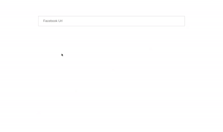

# VueJS URL Component

A Vue Url component is provide to add url (like instagramUrl,facebookUrl,webUrl, ..) with validation.
The Url value is automatically validated on blur event.
You can also disable url field using disable props.


## Table of contents

- [Browser Support](#browser-support)
- [Demo](#demo)
- [Getting started](#getting-started)
- [Usage](#usage)
- [Available Props](#available-props)
- [Methods](#methods)
- [Want to Contribute?](#want-to-contribute)
- [Need Help / Support?](#need-help)
- [Collection of Components](#collection-of-components)
- [Changelog](#changelog)
- [License](#license)
- [Keywords](#Keywords)

## Browser Support

|  |  |  |  |  |
| ---------------------------------------------------------------------------------------- | ------------------------------------------------------------------------------------------- | ---------------------------------------------------------------------------------------- | ---------------------------------------------------------------------------------- | ---------------------------------------------------------------------------------------------------------------------------- |
| 83.0 ✔                                                                                   | 77.0 ✔                                                                                      | 13.1.1 ✔                                                                                 | 83.0 ✔                                                                             | 11.9 ✔                                                                                                                       |

## Demo


[](https://github.com/weblineindia/Vue-URL-Component/url.gif)

## Getting started

Install the npm package:

```bash
npm install vue-weblineindia-url
#OR
yarn add vue-weblineindia-url
```

## Usage

Use the `<vue-weblineindia-url>` component:

```vue
<template>
  <div>
     <URL
      id="facebookUrl"
      name="facebookUrl"
      social-type="FACEBOOK"
      :tabindex="1"
      :placeholder="'Facebook Url'"
      :value="urlValue"
      :hide="false"
      :disabled="false"
      @focus="onFocus"
      @onBlur="onBlur"
      @onChange="onChangeUrl"
      :validation-regx="facebookUrlRegex"
    />
    <p
      v-show="invalidFacebookUrlError"
      :class="{
        control: true,
        'error-msg': invalidFacebookUrlError
      }"
    >
      <span>The url entered is not valid and must be changed</span>
    </p>
  </div>
</template>

<script>
import URL from "vue-weblineindia-url";
export default {
  components: { URL },
  data: function() {
    return {
      urlValue: "",
      invalidFacebookUrlError: false,
      facebookUrlRegex: /(?:(?:http|https):\/\/)?(?:www.)?facebook.com\/(?:(?:\w)*#!\/)?(?:pages\/)?(?:[?\w\-]*\/)?(?:profile.php\?id=(?=\d.*))?([\w\-]*)?/    };
  },

  methods: {
   /** on focus url field */
    onFocus(event) {
      event.target.placeholder = "";
    },
    /** on blur url field */
    onBlur(event, placeholder, errorObj) {
      event.target.placeholder = placeholder;
      const id = event.target.id;
      this.showUrlErrorMsg(id, errorObj);
    },
    /**
     * To show invalid url error msg
     */
    showUrlErrorMsg(id, errorObject) {
      if (errorObject.items.length > 0) {
        errorObject.items.map(err => {
          const urlId = err.field;
          switch (urlId) {
            case "facebookUrl":
              this.invalidFacebookUrlError = true;
              break;
          }
        });
      }
    },
    /** on change value on url**/
    onChangeUrl(value, id, index, error) {
      this.invalidFacebookUrlError = false;
      this.urlValue = value;
    }
  }
};
</script>
```


## Available Props

| Prop               | Type                                                                      | default | Description                                                                                                                                                                                                                                                     |
| ------------------ | ------------------------------------------------------------------------- | ------- | --------------------------------------------------------------------------------------------------------------------------------------------------------------------------------------------------------------------------------------------------------------- |
| value                 | String                                                                    |       | url value         |
| socialType          | String                                                                    |  FACEBOOK       |  url type     |                                                                                                                                                                                                                              
| validationRegx        | RegExp                                                                    |         | regex for url                                                                                                                                                                                                                 |
| placeholder              | String                                                                    | facebookUrl | url placeholder                                                                                                                                        |
| disabled            | Boolean                                                         | false    | disable url field|
|name | String                                                                   | facebookUrl   | name for url field                                                                                                                                                                                                                  |
| tabindex | Number | 1    | url tabIndex |
| id | String | facebookUrl    | name for url field |
| hide | Boolean | false   | for hide url field |


## Methods

| Name         | Description                                      |
| ------------ | ------------------------------------------------------------------------------------------------------------------------------------------------------------------------------------------------------------------------------------------------------------------------------------------------------------------------------------------------------------------------------------------------------------------------------------------------------------ |
| focus        | Gets triggered when the url input field receives focus.    |
| onBlur         | Gets triggered when the url input field loses focus. |
| onChange  | Gets triggered every time url got changed. |                                                                                                                                       

## Want to Contribute?

- Created something awesome, made this code better, added some functionality, or whatever (this is the hardest part).
- [Fork it](http://help.github.com/forking/).
- Create new branch to contribute your changes.
- Commit all your changes to your branch.
- Submit a [pull request](http://help.github.com/pull-requests/).

---

## Need Help?

We also provide a free, basic support for all users who want to use this VueJS URL Component in their software project. In case you want to customize this Url component to suit your development needs, then feel free to contact our [VueJS developers](https://www.weblineindia.com/hire-vuejs-developer.html).

---

## Collection of Components

We have built many other components and free resources for software development in various programming languages. Kindly click here to view our [Free Resources for Software Development](https://www.weblineindia.com/communities.html)

---

## Changelog

Detailed changes for each release are documented in [CHANGELOG.md](./CHANGELOG.md).

## License

[MIT](LICENSE)

[mit]: https://github.com/weblineindia/Vue-URL-Component/blob/master/LICENSE

## Keywords

vue-weblineindia-url,url,vue components,vuejs,vuejs component
